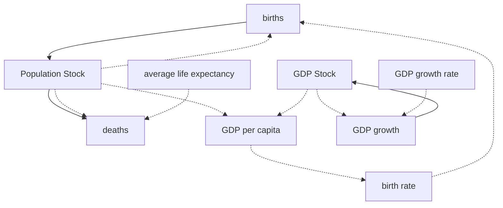

# Part 2: Vensim SFD Modeling Guide
This guide is designed for **Part 2 of the ORSA Exam** (Max 50 points), where you must draw a **Stock and Flow Diagram (SFD)** in **Vensim PLE** based on a text description and upload the `.mdl` file.

---

## 🛠️ 1. Vensim PLE Building Blocks
To build a correct model, you must use Vensim's toolbar elements correctly:
1. **Stock (Level / Box Variable)**: Represents accumulations or states. Box variable in Vensim.
   * *Equation*: `Stock = INTEG (Inflows - Outflows, Initial Value)`.
   * *Example*: `Infected population` or `Total deaths`.
2. **Flow (Rate)**: Represents changes to stocks per time unit. Flows directly into or out of stocks.
   * *Equation*: Usually a formula based on auxiliaries, constants, and stocks.
   * *Example*: `infection rate` or `death rate`.
3. **Auxiliary Variable**: Holds intermediate calculations or variables that change over time.
   * *Example*: `share of infected on the total population`.
4. **Constant**: Fixed parameters that do not change during the simulation.
   * *Example*: `INFECTIVITY = 0.05` or `MORTALITY = 0.03`.
5. **Causal Link (Arrow)**: Represents information flow. Draw an arrow from $A$ to $B$ to make variable $B$ a function of variable $A$.

---

## 🚨 2. Critical Rules to Avoid Point Deductions
The practical part of the exam is graded by subtracting points for mistakes. Follow these rules carefully:

* **Rule 1: Never Connect Stock to Stock Directly (-10 points)**
  * *Mistake*: Putting a causal arrow directly between two stock boxes.
  * *Correct*: A stock can **only** be connected to another stock via a **Flow Pipe** (Rate). Information arrows can only go from stocks to flows or auxiliaries, never directly to other stocks.
* **Rule 2: Correct Link Polarities (-5 points)**
  * Put a sign ($+$ or $-$) on every arrow.
  * If $A$ increases and causes $B$ to increase, put a **$+$** sign (or **S** for "Same").
  * If $A$ increases and causes $B$ to decrease, put a **$-$** sign (or **O** for "Opposite").
* **Rule 3: Identify and Name Feedback Loops (-6 points / -4 points)**
  * If a path of arrows forms a closed loop, identify it as either:
    * **Reinforcing (R / +)**: Even number of negative links.
    * **Balancing (B / -)**: Odd number of negative links.
  * Use the **Loop Utility** in Vensim to place the loop identifier (e.g., `B1` or `R1`) inside the loop.
* **Rule 4: Understand the "without f(x)" Tip**
  * In the tutorial slides, the instructor specifies: **"SFD in Vensim PLE (without f(x))"** for certain terms.
  * If this is specified on the exam, you **only** need to draw the diagram structure, links, polarities, and loops. You do **not** need to open the equations editor ($f(x)$ tool) and write the mathematical formulas.
  * However, if the text asks for equations, or does not specify "without f(x)", you **must** write them.

---

## 📐 3. Common Exam Modeling Templates
These are the exact structures and equations used in the course assignments:

### Template A: The Epidemic (SIR) Model (`EPIDEMY.mdl`)
This models disease spread in a population. Note the exact variable names and equations from the course file:

```mermaid
graph LR
    Susceptible[Susceptible population] -- "infection rate" --> Infected[Infected population]
    Infected -- "recovery with imunity" --> Immune[Imune population]
    Infected -- "recovery without imunity" --> Susceptible
    Infected -- "death rate" --> Deaths[Total deaths]
    
    contacts[totla number of risk contacts] -.-> infection rate
    share[share of infected on the total population] -.-> infection rate
    infectivity[INFECTIVITY] -.-> infection rate
    
    avg_contacts[AVERAGE NUMBER OF RISK CONTACTS] -.-> contacts
    Susceptible -.-> contacts
    
    Infected -.-> share
    Susceptible -.-> share
    Immune -.-> share
    
    duration[AVERAGE DUTATION OF INFECTION] -.-> exit_rate[exit rate]
    Infected -.-> exit_rate
    
    exit_rate -.-> recovery_rate[recovery rate]
    mortality[MORTALITY] -.-> recovery_rate
    
    recovery_rate -.-> recovery_with[recovery with imunity]
    share_immune[SHARE OF IMUNE] -.-> recovery_with
    
    recovery_rate -.-> recovery_without[recovery without imunity]
    share_immune -.-> recovery_without
    
    exit_rate -.-> death_rate
    mortality -.-> death_rate
```

#### Equations for SIR Model:
1. **Susceptible population (Stock)**:
   `INTEG (recovery without imunity - infection rate, 49990)`
2. **Infected population (Stock)**:
   `INTEG (infection rate - recovery without imunity - recovery with imunity - death rate, 10)`
3. **Imune population (Stock)**:
   `INTEG (recovery with imunity, 0)`
4. **Total deaths (Stock)**:
   `INTEG (death rate, 0)`
5. **infection rate (Flow)**:
   `totla number of risk contacts * share of infected on the total population * INFECTIVITY`
6. **totla number of risk contacts (Auxiliary)**:
   `Susceptible population * AVERAGE NUMBER OF RISK CONTACTS`
7. **share of infected on the total population (Auxiliary)**:
   `Infected population / (Infected population + Susceptible population + Imune population)`
8. **exit rate (Auxiliary)**:
   `Infected population / AVERAGE DUTATION OF INFECTION`
9. **recovery rate (Auxiliary)**:
   `exit rate * (1 - MORTALITY)`
10. **recovery with imunity (Flow)**:
    `recovery rate * SHARE OF IMUNE`
11. **recovery without imunity (Flow)**:
    `recovery rate * (1 - SHARE OF IMUNE)`
12. **death rate (Flow)**:
    `exit rate * MORTALITY`
13. **Parameters (Constants)**:
    * `AVERAGE NUMBER OF RISK CONTACTS = 10`
    * `AVERAGE DUTATION OF INFECTION = 7` (note the typo "DUTATION")
    * `INFECTIVITY = 0.05`
    * `SHARE OF IMUNE = 0.5`
    * `MORTALITY = 0.03`
14. **Time Parameters**:
    * `INITIAL TIME = 0`
    * `FINAL TIME = 100` (Days)
    * `TIME STEP = 0.03125`

---

### Template B: Population Growth & GDP feedback (`Popul_all.mdl` / `Popul_4.mdl`)
This models population dynamics combined with economic indicators.



#### Equations:
1. **Population (Stock)**:
   `INTEG (births - deaths, 458)`
2. **births (Flow)**:
   `Population * birth rate`
3. **deaths (Flow)**:
   `Population / average life expectancy`
4. **GDP (Stock)**:
   `INTEG (GDP growth, 430)`
5. **GDP growth (Flow)**:
   `GDP * GDP growth rate`
6. **GDP per capita (Auxiliary)**:
   `GDP / Population`
7. **birth rate (Auxiliary WITH LOOKUP)**:
   `WITH LOOKUP (GDP per capita, ([(0,0.02)-(20,0.05)],(0.44,0.0288),(1.22,0.032),(1.90,0.0307),(20,0.0307)))`
8. **GDP growth rate (Auxiliary WITH LOOKUP)**:
   `WITH LOOKUP (Time, ([(0,0)-(2021,0.07)],(1500,0.0007),(1820,0.006),(1950,0.025),(1980,0.06),(1990,0.02),(2021,0.05)))`
9. **average life expectancy (Auxiliary WITH LOOKUP)**:
   `WITH LOOKUP (Time, ([(0,0)-(2021,70)],(0,35),(1800,35),(1950,50),(2000,70),(2021,70)))`
10. **Time Parameters**:
    * `INITIAL TIME = 1500`
    * `FINAL TIME = 2020` (Years)
    * `TIME STEP = 0.125`

---

### Template C: Production and Inventory Control
This models industrial stock instability. It consists of three successive versions:

#### Version 1: Simple Inventory Control
1. **Inventory (Stock)**:
   `INTEG (production - shipment, 4000)`
2. **shipment (Flow)**:
   `customer orders`
3. **customer orders (Auxiliary)**:
   `1000 * (1 + STEP (0.1, 10))`
4. **average order rate (Auxiliary)**:
   `SMOOTH (customer orders, time period for averaging orders)`
5. **desired inventory (Auxiliary)**:
   `average order rate * time period for inventory holdings`
6. **desired production (Auxiliary)**:
   `average order rate + inventory correction`
7. **inventory correction (Auxiliary)**:
   `(desired inventory - Inventory) / time period for reconciling inventory`
8. **production (Flow)**:
   `desired production`
9. **Parameters**:
   * `time period for averaging orders = 8`
   * `time period for inventory holdings = 4`
   * `time period for reconciling inventory = 8`

#### Version 2: Adding a Workforce Delay
Instead of production matching desired production instantly, a workforce must be hired:
1. **production (Flow)**:
   `production rate`
2. **production rate (Auxiliary)**:
   `Workforce * average productivity`
3. **desired workforce (Auxiliary)**:
   `desired production / average productivity`
4. **Workforce (Stock)**:
   `INTEG (hire rate - quit rate, 50)`
5. **hire rate (Flow)**:
   `quit rate + workforce correction`
6. **quit rate (Flow)**:
   `Workforce / time period of average employment`
7. **workforce correction (Auxiliary)**:
   `(desired workforce - Workforce) / time period to hire new workers`
8. **Parameters**:
   * `average productivity = 20` (units/person/week)
   * `time period of average employment = 50` (weeks)
   * `time period to hire new workers = 24` (weeks)

#### Version 3: Adding Schedule Pressure (Lookup Table)
Workers work overtime/undertime depending on schedule pressure:
1. **production (Flow)**:
   `production rate * effect of schedule pressure`
2. **schedule pressure (Auxiliary)**:
   `desired production / production rate`
3. **effect of schedule pressure (Auxiliary WITH LOOKUP)**:
   `table1 (schedule pressure)`
4. **table1 (Lookup)**:
   `([(0.8,0.8)-(1.2,1.3)],(0.8,0.875),(0.9,0.875),(1,1),(1.1,1.25),(1.2,1.25))`

---

### Template D: Prison Recidivism Model (`Prison.mdl`)
This models offenders cycling between society and prison.

1. **People in prison (Stock)**:
   `INTEG (repeat offenders - leaving prison, Initial Prisoners)`
2. **Ex prisoners (Stock)**:
   `INTEG (leaving prison - repeat offenders, Initial Ex-prisoners)`
3. **leaving prison (Flow)**:
   `People in prison / average length of sentence`
4. **repeat offenders (Flow)**:
   `Ex prisoners * fractional recidivism rate`
5. **fractional recidivism rate (Auxiliary WITH LOOKUP)**:
   Depends on `Prison conditions level` (which deteriorates as prison occupancy increases).
6. **average length of sentence (Constant)**:
   `12` (Months)

---

## 📝 4. Pre-Submission Checklist
Before saving your `.mdl` file and uploading it to Moodle, check the following:
1. **Check Equations Tool**: Click on the **Equations (f(x))** tool in Vensim. Are all variables black (have equations defined)? If any variable is highlighted, it is missing an equation.
2. **Units Verification**: Click **Model ➔ Unit Check** in Vensim. While units are not always graded, checking units catches equation errors (e.g. adding a flow to a stock instead of integrating it).
3. **Model Simulation**: Click the **Simulate (Play)** button. If you get a simulation error (e.g., "division by zero" or "floating point error"), check your division terms. (Always add a small number to division terms if division by zero is possible, e.g. `denominator + 1e-6`).
4. **Time Bounds**: Ensure your time parameters match the assignment text:
   * **INITIAL TIME** (usually `0`)
   * **FINAL TIME** (e.g., `100` or `50`)
   * **TIME STEP** (typically `1` or `0.03125` for smoother curves)
